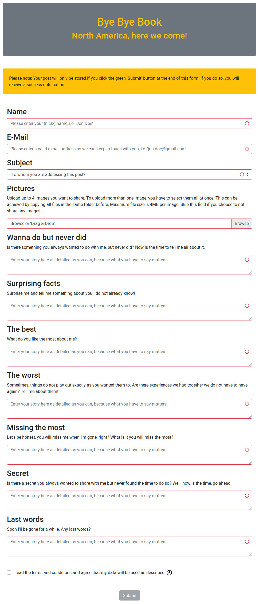
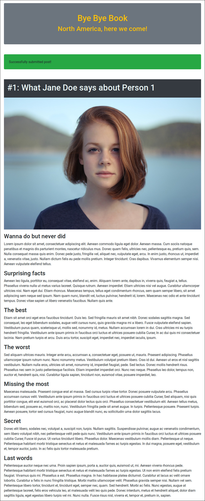
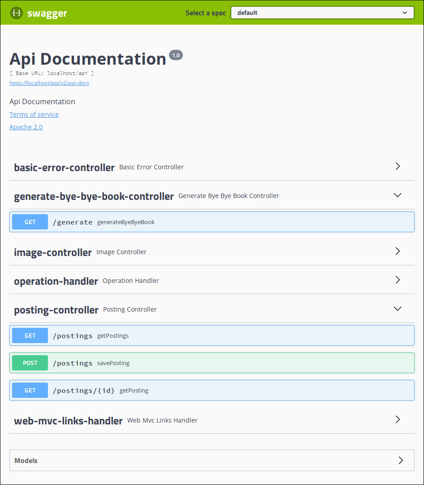
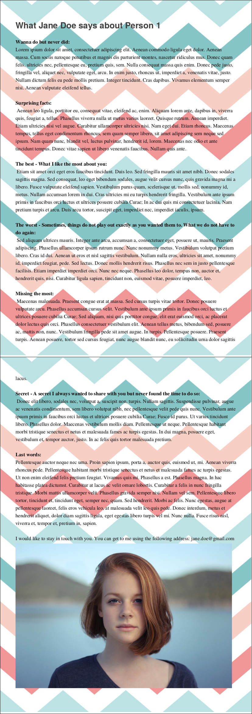

# Bye Bye Book
A full stack web service designed to collect posts from friends for a personal friendship book. The frontend is a [Vue.js](https://vuejs.org/) browser app providing a simple web form users can fill out. The backend is a [Srping Boot](https://spring.io/projects/spring-boot) RESTful web service which is used to persist the user data storing it in a relational database. 

## Features
* Provide a web form users can fill out
* Show summary of all posts when run in `admin` mode
* REST endpoints to store and retrieve posts
* REST endpoints to store and retrieve images
* REST endpoint to download all entries as a `*.pdf` document

### (1) Form to add a post

### (2) Summary view of post

### (3) REST endpoints

### (4) Exported Bye Bye Book

## How to run using Docker, Gradle, Node.js on Linux
### Build Bye Bye Book client
* `$ cd src/bbb-client/`
* `$ npm install`
* `$ npm run build`

### Build Bye Bye Book server
* `$ cd src/bbb-server/`
* `$ ./gradlew build`

### Start Docker service stack
* `$ cd docker/bbb/`
* `$ docker-compose up` (production mode, no access to [/api/postings](/api/postings))
* `$ docker-compose -f docker-compose_admin.yml up` (admin mode, access to [/api/postings](/api/postings))
* The following addresses are available:
    - [All posts](https://localhost): Overview of all posts present (empty if not running in admin mode)
    - [Add a post](https://localhost/add): Web form to add an entry to the friendship book
    - [REST endpoint overview](https://localhost/api/swagger-ui.html): Overview of all REST endpoints available
    - [Generate Bye Bye Book](https://localhost/api/generate): Generate a friendship book and retrieve a `*.pdf` document

## License
* AGPL-3.0-or-later
